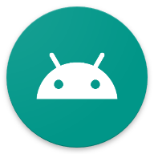
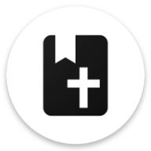
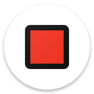
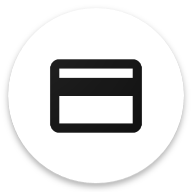

# Bassie's Android Apps

A collection of various Android apps that I created for myself and others

## Android Apps

<table>
<tr>
<td width="120" align="center">
<a href="bin/bassiemusic/">
    <br/>
    BassieMusic
</a>
</td>
<td width="120" align="center">
<a href="bin/bassietest/">
    <br/>
    BassieTest
</a>
</td>
<td width="120" align="center">
<a href="bin/bible/">
    <br/>
    Bible
</a>
</td>
<td width="120" align="center">
<a href="bin/coinlist/">
    <br/>
    CoinList
</a>
</td>
<td width="120" align="center">
<a href="bin/hackernews/">
    <br/>
    HackerNews
</a>
</td>
</tr>
<tr>
<td width="120" align="center">
<a href="bin/reacttest/">
    <br/>
    ReactTest
</a>
</td>
<td width="120" align="center">
<a href="bin/redsquare/">
    <br/>
    Redsquare
</a>
</td>
<td width="120" align="center">
<a href="bin/rfidviewer/">
    <br/>
    RFID Viewer
</a>
</td>
<td width="120" align="center">
<a href="bin/tweakers/">
    <br/>
    Tweakers
</a>
</td>
</tr>
</table>

-   [BassieMusic](bin/bassiemusic/) A simple Android app to listen to local music!
-   [BassieTest](bin/bassietest/) A example test app for the bob build tool and sandbox for some ideas
-   [Bible](bin/bible/) An offline Android Bible app containing multiple bible translations
-   [CoinList](bin/coinlist/) A cryptocurrency information app similar to the [coinlist](https://github.com/bplaat/coinlist) website
-   [HackerNews](bin/hackernews/) A simple [HackerNews](https://news.ycombinator.com/) webview app because installed PWA's suck sadly
-   [ReactTest](bin/reacttest/) A test app for the [ReactDroid](lib/reactdroid/) library
-   [Redsquare](bin/redsquare/) A port of the [RedSquare](https://github.com/plaatsoft/redsquare) game to Android
-   [RFID Viewer](bin/rfidviewer/) A Mifare Classic / RFID card viewer / writer app
-   [Tweakers](bin/tweakers/) A simple [Tweakers](https://tweakers.net/) webview app because installed PWA's suck sadly

## Android Libraries

-   [Alerts](lib/alerts/) A rating and update alert library
-   [Compat](lib/compat/) Wrappers around deprecated/changed Android API's
-   [Fetch](lib/fetch/) Some utils to fetch data and image from the internet
-   [ReactDroid](lib/reactdroid/) A [Litho](https://fblitho.com/) inspired declarative Android view component library

## Getting Started

-   Install Java JDK 21
-   Install Android SDK with `cmdline-tools`, `platform-tools`, `build-tools:36` and `platforms:android-36` and set `$ANDROID_HOME` env var
-   Install a [Rust toolchain](https://rustup.rs/)
-   Install [bob](https://github.com/bplaat/crates/tree/master/bin/bob)
    ```sh
    cargo install --git https://github.com/bplaat/crates bob
    ```
-   Run `./meta.sh check`

## License

Copyright © 2018-2025 [Bastiaan van der Plaat](https://github.com/bplaat)

Licensed under the [MIT](LICENSE) license.
